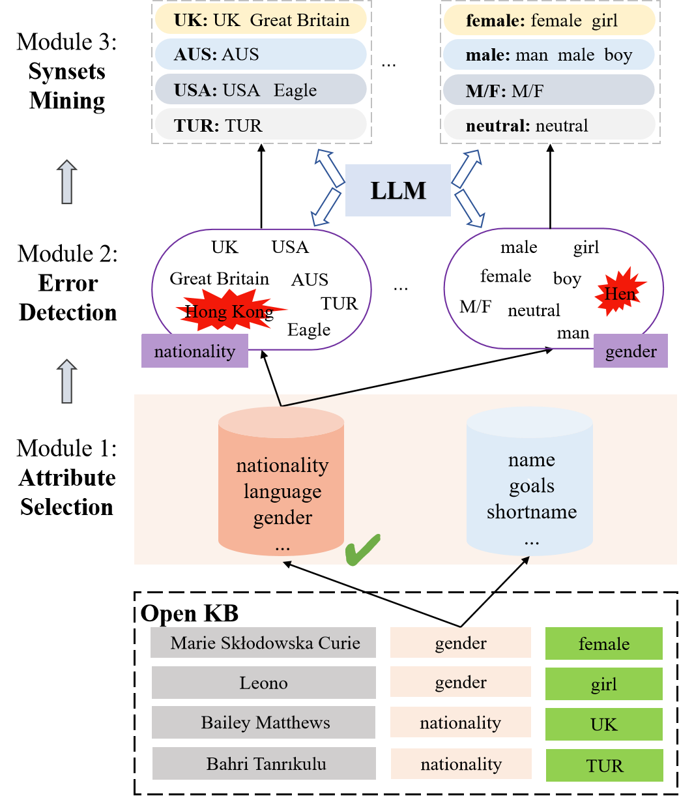

# How do LLMs assist the Canonicalization of Attribute Values in Open KBs?

Source code and dataset for paper: How do LLMs assist the Canonicalization of Attribute Values in Open KBs?
<!-- -->



the first two step (attribute selection and error detection require human involvement) are not included in this repository.

The repository is only for the third step 'Synsets Mining', which is a fully-automatic process.

### Dependencies

Compatible with Python 3.x
Dependencies can be installed using requirements.txt


### Datasets
The input to Caf4AV is a attribute value list in an Open KB. After Caf4av, all values under an attribute will be divided into three groups: *clusters*, *single_vs*, *error_vs*.  An example is shown below:

```json
{
	"nationalOrigin": {
		"all": {
			"clusters": {
				"Australia/United States": [
					"Australia and the United States",
					"Australia/United States",
					"United States / Australia"
				],
				"USA": [
					"US",
					"U.S.",
					"U.S.A",
					"United States of America",
					"U.S.A.",
					"United States",
					"United States /",
					"America",
					"USA"
				]
			},
			"single_vs": [
				"German-Swedish",
				"Czech Republic",
				"United Kingdom/Italy",
				"Multi-national",
				"Slovakia"
			],
			"error_vs": [
				"Multinational",
				"Ten-seat passenger transport"
			]
		}
	}
}
```

* `error_vs` denotes the values that should not appear under an attribute.
* `clusters` denotes the synsets mined under an attribute.
* `single_vs` denotes the remained values under an attribute that have no synonyms.

### Usage:

##### text embedding
getting embeddings from OpenAI's api `text-embedding-3-large` for every value by `text_embedding.py`;

##### similarity calculation
calculating similarities for all value pairs under an attribute by `similarity.py`;

##### clustering by hac
conducting hac on similarities by `hac.py`; 

##### correction with LLMs
correcting clustering results with LLMs by `post_pre4cluster`;

##### clustering directly by LLMs
finding synonyms directly by LLMs by `final_cluster_by_api.py`;
